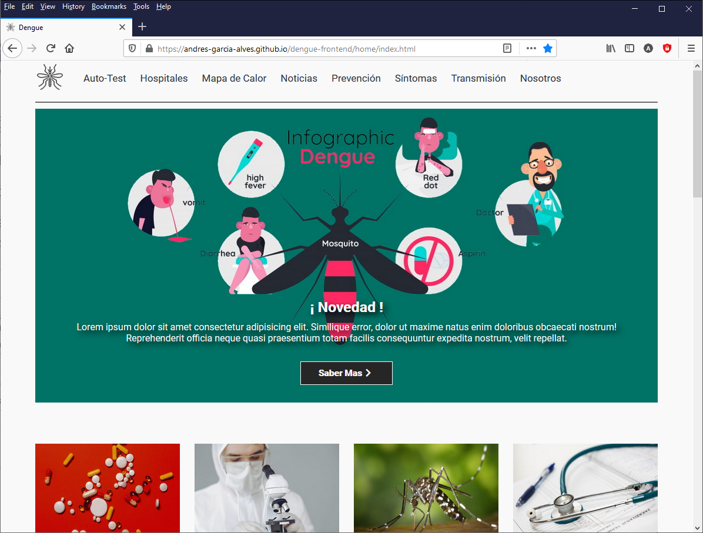
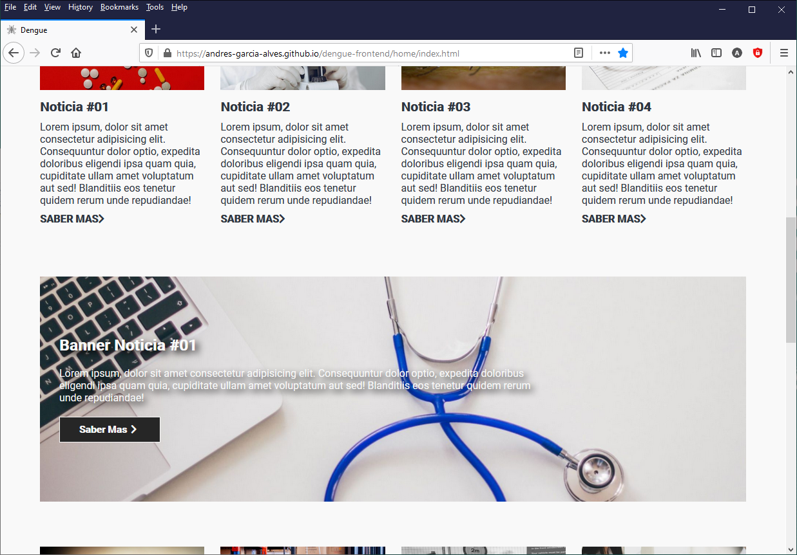
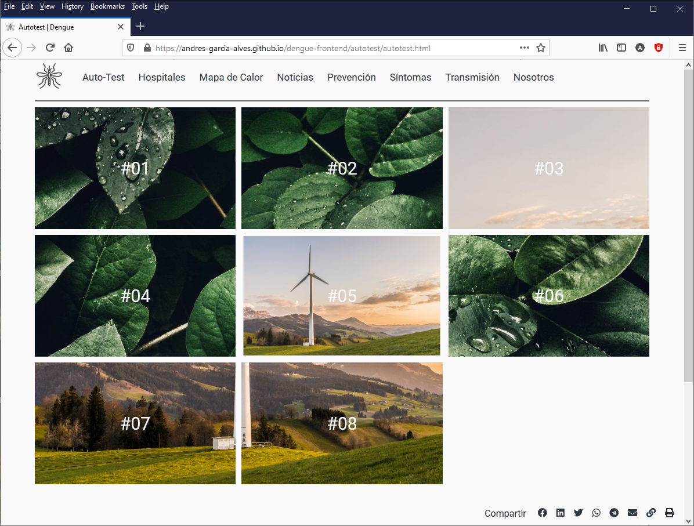
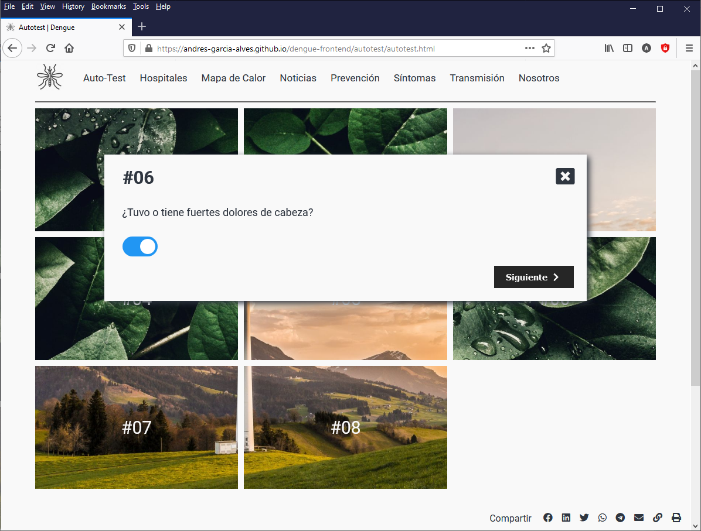
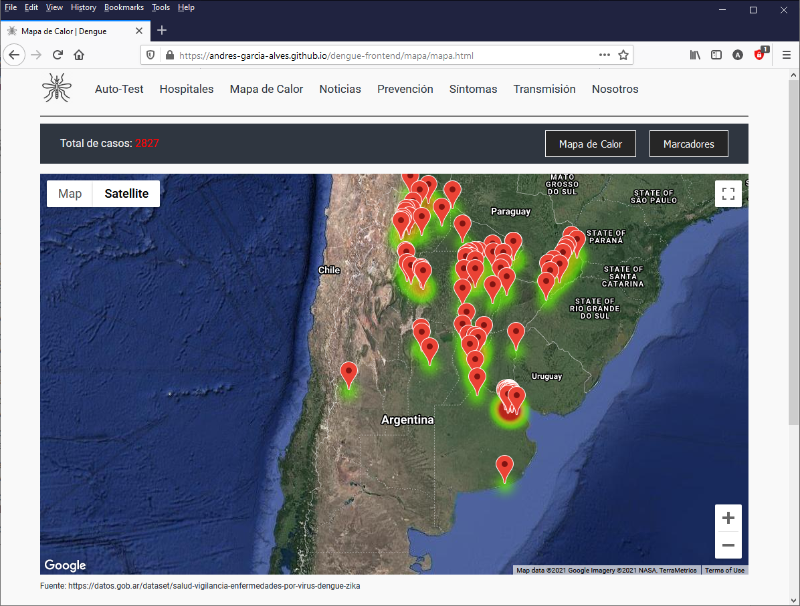
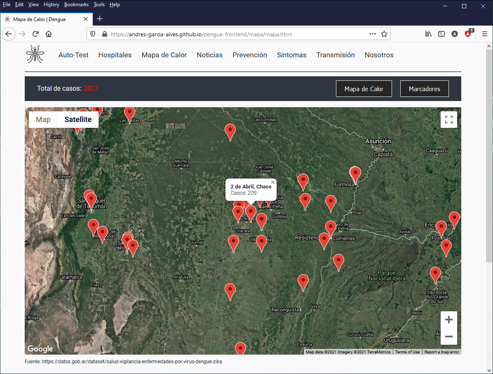
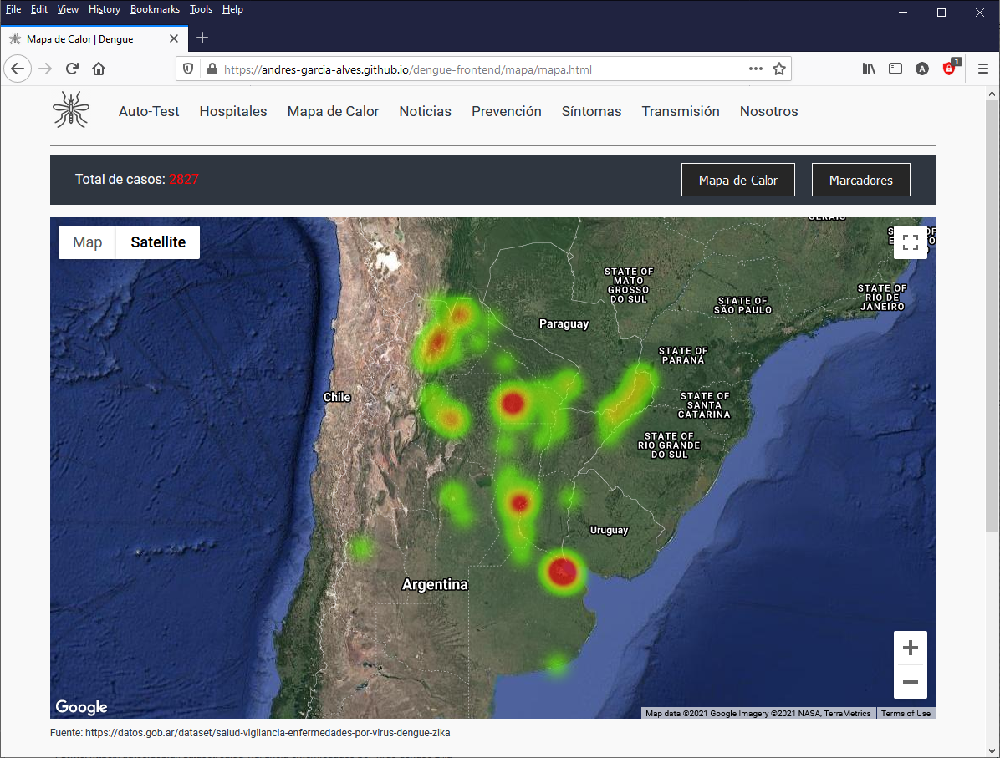
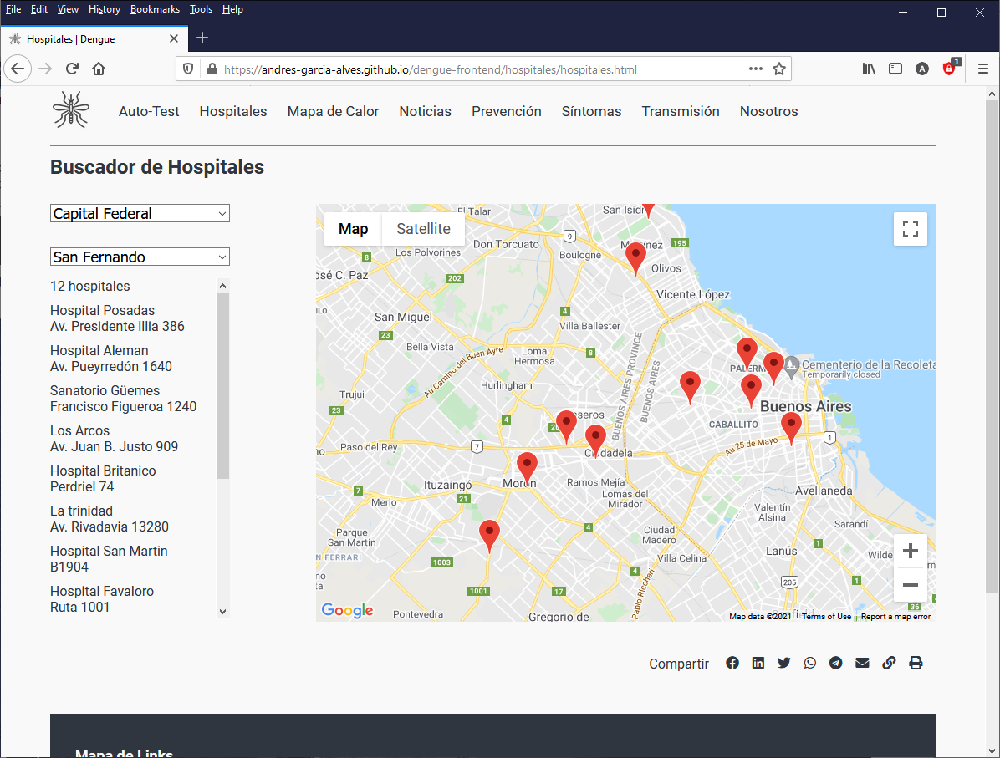
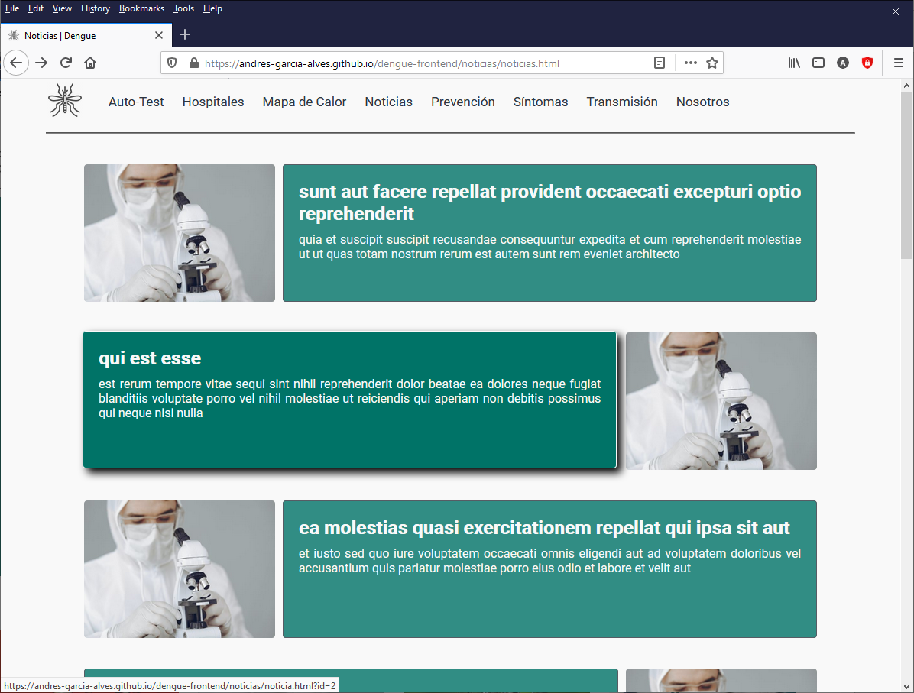
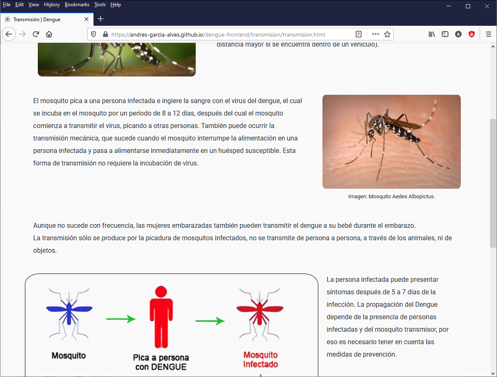

# Dengue Frontend

A responsive website with dengue prevention info, cases hot-map, self-test, hospital locator and more...  
[LIVE DEMO HERE](https://andres-garcia-alves.github.io/dengue-frontend/).  

Built in vanilla javascript, using modern technologies like: google-maps, web-components, media-queries, flexbox, css-grid, css-custom-properties, etc.

&nbsp;

### Screenshots

| Home page                                           | Home page                                           |
|-----------------------------------------------------|-----------------------------------------------------|
|           |           |

| Home page                                           | Self-Test                                           |
|-----------------------------------------------------|-----------------------------------------------------|
|           |       |

| Self-Test                                           | Cases Hot-Map                                       |
|-----------------------------------------------------|-----------------------------------------------------|
|       |  |

| Cases Hot-Map                                       | Cases Hot-Map                                       |
|-----------------------------------------------------|-----------------------------------------------------|
|  |  |

| Hospitals                                           | News                                                |
|-----------------------------------------------------|-----------------------------------------------------|
|        |          |

| Prevention info                                     | Propagation info                                    |
|-----------------------------------------------------|-----------------------------------------------------|
|        |       |

&nbsp;
&nbsp;

Developed for subject 'Desarrollo de un Proyecto', on CAECE University, Buenos Aires, Argentina.  

This is the first public release of this proyect.  
If you want, please send me your feedback about this game: andres.garcia.alves@gmail.com
