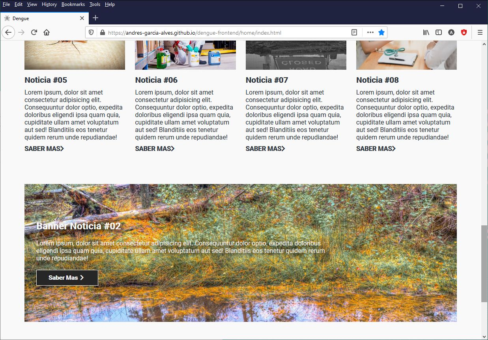
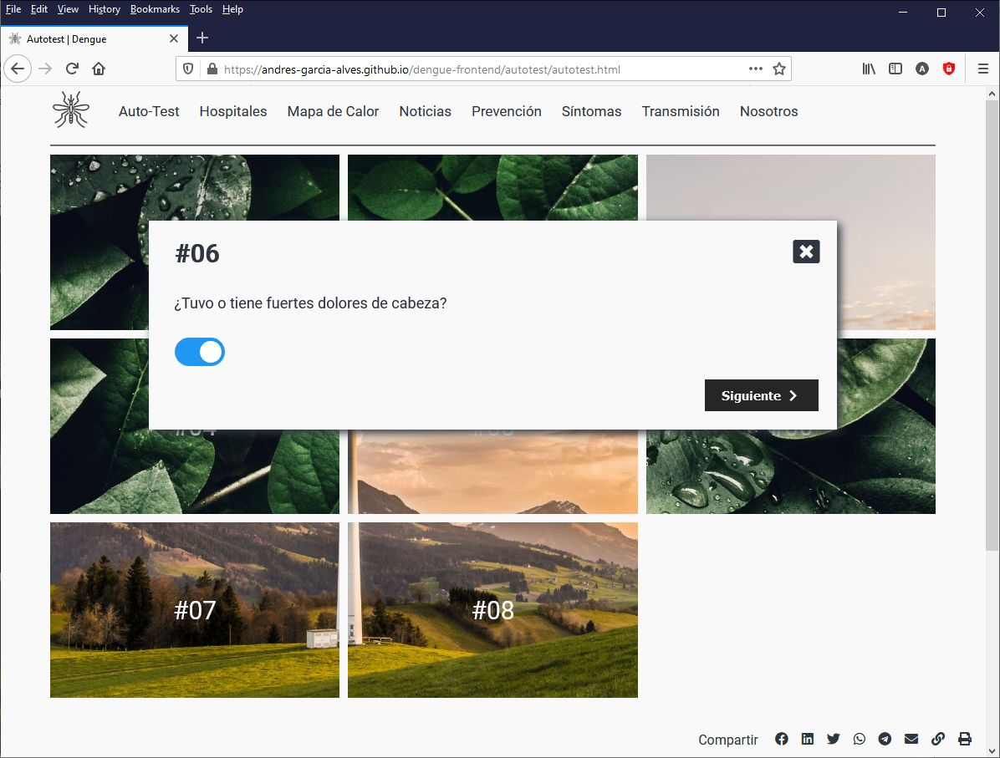
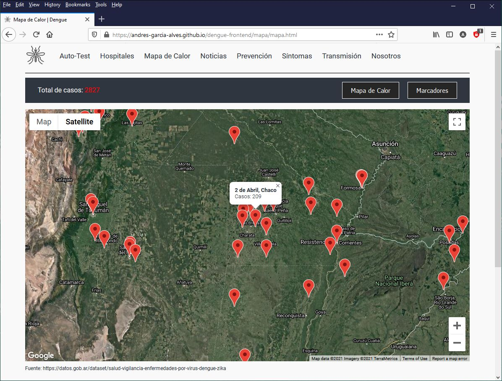
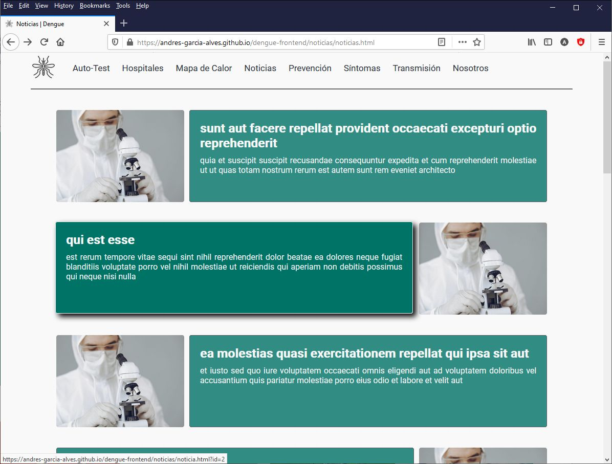
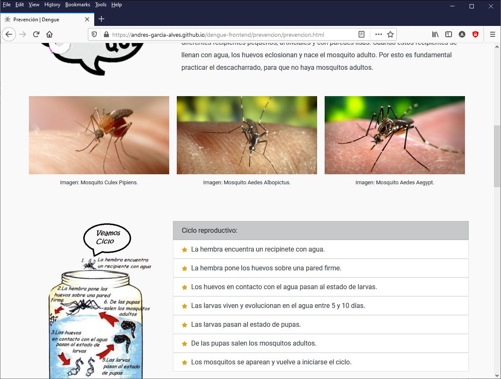

# Dengue Website

A responsive website with dengue prevention info, cases hot-map, self-test, hospital locator and more...  
[LIVE DEMO HERE](https://andres-garcia-alves.github.io/dengue-website/).  

Built in vanilla javascript, using modern technologies like: google-maps, web-components, media-queries, flexbox, css-grid, css-custom-properties, etc.

&nbsp;

### Screenshots

| Home page                                           | Home page                                           |
|-----------------------------------------------------|-----------------------------------------------------|
|           |           |

| Home page                                           | Self-Test                                           |
|-----------------------------------------------------|-----------------------------------------------------|
|           |       |

| Self-Test                                           | Cases Hot-Map                                       |
|-----------------------------------------------------|-----------------------------------------------------|
|       |  |

| Cases Hot-Map                                       | Cases Hot-Map                                       |
|-----------------------------------------------------|-----------------------------------------------------|
|  |  |

| Hospitals                                           | News                                                |
|-----------------------------------------------------|-----------------------------------------------------|
|        |          |

| Prevention info                                     | Propagation info                                    |
|-----------------------------------------------------|-----------------------------------------------------|
|        |       |

&nbsp;

### Version History

v1.0 (2021.05.12) - Initial release.  

&nbsp;

This is the first public release of this project.  
Developed for subject 'Desarrollo de un Proyecto', at CAECE University, Buenos Aires, Argentina.  

This source code is licensed under MIT licence.  
Please send me your feedback about this website: andres.garcia.alves@gmail.com
